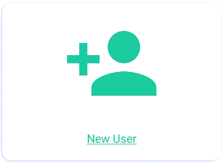

Start a New Project (version 1.4.0-rc)
=======

Open the Program and Set Up New User
-----

1.	Tap on the BTT Recorder program icon on the tablet screen.

2.	Tap on 'New User' card to create a profile.

3. Read, or have someone read to you, the three Terms of Use.

*  Tap on each of the green bars.
*  Read the content. You may need to scroll to see the entire contents of the ‘Translation Guidelines’ and the ‘Statement of Faith’.
*  Tap on ‘Close’ at the bottom of each of the windows. 

Note: Tapping on the green 'NO THANKS' link will close the program. 

4.	Tap the green I AGREE link at the bottom of the window if you agree with all three statements.

5. Tap the Record icon (microphone) and record your name.  

   A pseudonym is a false name that is used instead of the real name of the person doing the work.

6. You will need to record your name while the red circle is going around – 3 seconds.

7. Press the play button to listen to the recording.

If you can you hear your voice and understand your words, then tap the green Yes button.

If your voice is too soft and you cannot understand your words, then tap the Redo button to make another recording.

When you accept the recording - the opening recording screen opens, and you are ready to start a new project.

From the Recording Section (Blue)
-----------

**NOTE**: A new project can be started in the Recording Section when it is the first time BTT Recorder is used (a new install.)

1.	From the home screen (half blue and half green), tap in the blue area to start recording.

**NOTE**: You may tap on the left arrow in the top pink bar to go back to the previous screen at any time. You may want to go to the previous screen to make a different choice.

2.	Select the Target Language.  (The Target Language is the language into which you will translate.)

•	You can search for your desired language by tapping the magnifying glass. 
•	The Keyboard appears. Type in the language or language code. Close the keyboard by using the down arrow icon, or back arrow icon.  
•	You can also search by swiping from the bottom of the screen up to scroll through the languages. Tap on the desired language.
•	Tap on the name of the desired Target Language. The program goes to the Choose a Project step.
 
4.	Choose a Project - Choose, by tapping once, from the choices of Bible: OT or Bible: NT.

5. Choose a Book - Tap on a book in the Bible. Swipe up to see more book names.

6. Choose a Translation Type - Tap to choose from the Unlocked Literal Bible or the Unlocked Dynamic Bible.

7. Choose a Mode - Tap to choose either Verse or Chunk mode. This is how the information will be divided. 

  * The ‘Verse’ mode has each recording separated like a regular Bible, one verse at a time.
  * The ‘Chunk’ mode has each recording separated according to groups of verses.

8.	Next, select the Source Audio. (The Source Language audio is the language from which you will translate.)

•	You can search for the desired source language by tapping the magnifying glass. 
•	The Keyboard appears. Type in the language or language code. Close the keyboard by using the down arrow icon, or back arrow icon.  
•	You can also search by swiping from the bottom of the screen up to scroll through the languages.
•	Tap on the name of the desired Source Language. The program goes back to the Source Audio window.

9.	Tap on the blue SELECT SOURCE LOCATION button.

•	The file manager should open to the directory of where the audio files are located.

**NOTE**: The audio files are configured in this way: Language_3-letterbookcode_type.tr  So, for the ULB audio of the book of Titus in Mandarin the file would be named "cmn_ulb_Titus.tr". 

**Hint**: You may need to look in the Internal Storage for the SourceAudio folder. 

•	Tap on the name of the desired Source Language audio file. The program goes back to the Source Audio window.

10. Tap on the word ‘CONTINUE’ at the bottom right of the screen. 

The recording window opens.
You have now set all your settings and are ready to work within BTT Recorder. 

At any time you may tap the back arrow at the bottom left of the screen. That will take you out to the main menu.

From the Project Manager Section (Green)
---------------

1.	From the home screen (half blue and half green), tap in the green area to access Projects.

2.	Tap on the green ‘New Project’ button that is seen only on a new install. Or, tap on the blue circle with a white plus sign.

**NOTE**: You may tap on the left arrow in the top blue bar to go back to the previous screen at any time. You may want to go to the previous screen to make a different choice.

3.	Select the Target Language.  (The Target Language is the language into which you will translate.)

•	You can search for your desired language by tapping the magnifying glass. 
•	The Keyboard appears. Type in the language or language code. Close the keyboard by using the down arrow icon, or back arrow icon.  
•	You can also search by swiping from the bottom of the screen up to scroll through the languages. Tap on the desired language.
•	Tap on the name of the desired Target Language. The program goes to the Choose a Project step.

4.	Choose a Project - Choose, by tapping once, from the choices of Bible: OT or Bible: NT.

5. Choose a Book - Tap on a book in the Bible. Swipe up to see more book names.

6. Choose a Translation Type - Tap to choose from the Unlocked Literal Bible or the Unlocked Dynamic Bible.

7. Choose a Mode - Tap to choose either Verse or Chunk mode. This is how the information will be divided. 

  * The ‘Verse’ mode has each recording separated like a regular Bible, one verse at a time.
  * The ‘Chunk’ mode has each recording separated according to groups of verses.

8.	Next, select the Source Audio. (The Source Language audio is the language from which you will translate.)

•	You can search for the desired source language by tapping the magnifying glass. 
•	The Keyboard appears. Type in the language or language code. Close the keyboard by using the down arrow icon, or back arrow icon.  
•	You can also search by swiping from the bottom of the screen up to scroll through the languages.
•	Tap on the name of the desired Source Language. The program goes back to the Source Audio window.

9.	Tap on the blue SELECT SOURCE LOCATION button.

•	The file manager should open to the directory of where the audio files are located.

**NOTE**: The audio files are configured in this way: Language_3-letterbookcode_type.tr  So, for the ULB audio of the book of Titus in Mandarin the file would be named "cmn_ulb_Titus.tr". 

**Hint**: You may need to look in the Internal Storage for the SourceAudio folder. 

•	Tap on the name of the desired Source Language audio file. The program goes back to the Source Audio window.

10. Tap on the word ‘CONTINUE’ at the bottom right of the screen. 

The program opens the recording screen. Go to the (http://tr-info.readthedocs.io/en/latest/recording.html) for more instruction.

